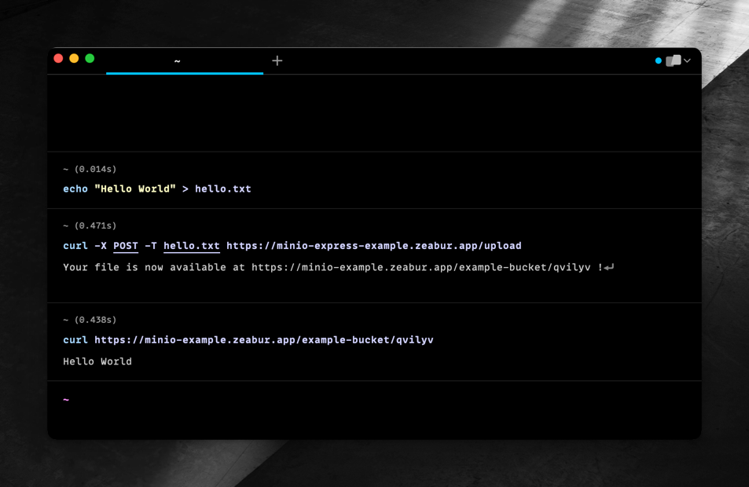

# Express.js MinIO Example




This example shows how to develop a simple Express.js application that uses MinIO as a storage backend.

You must first create a account on [Zeabur](https://zeabur.com), create a project and deploy a MinIO service from service marketplace.

## Getting Started

### Step 1

You can run the following command to generate a `.env` file, then fill in the required information.

> Note: You don't need to set these values in production, zeabur will set them for you
>
> these values are only required for local development

```bash
cp .env.example .env
```

### Step 2: Install Dependencies

```bash
pnpm install
```

### Step 3: Run the app

```bash
pnpm dev
```

Open [http://localhost:3000](http://localhost:3000) with your browser to see the result.

You can also check the following routes:

- [/upload](http://localhost:3000/upload): Upload a file (POST)
- [/objects](http://localhost:3000/objects): List all objects in the bucket (GET)
- [/objects/:objectName](http://localhost:3000/objects/:objectName): Get an object (GET)
