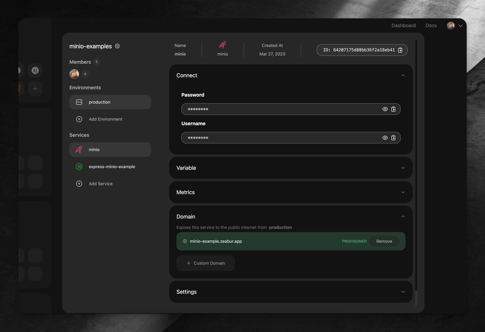

# Express.js MinIO Example

This example shows how to develop a simple Express.js application that uses MinIO as a storage backend.

You must first create a account on [Zeabur](https://zeabur.com), create a project and deploy a MinIO service from service marketplace.

## Getting Started

WIP
